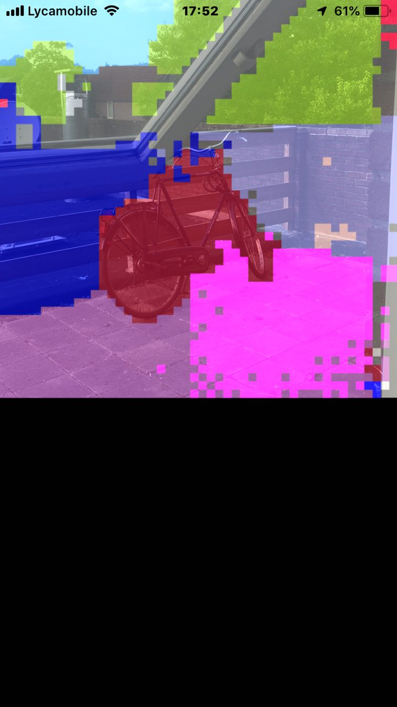

# BlindAssist
BlindAssist is an iOS application which has the goal to support blind people
on the road. Since I have a blind brother, I decided to create this open source
project.

The assisting process will be done using deap learning, image segmentation
and translating the inference results to sentences which will be spoken out loud 
by tts (text to speech).

Currently BlindAssist uses CoreML. You can clone my other repo to get that model
to use it with this app.

https://github.com/gi097/blindassist-scripts

# Help is needed!
Do you have great ideas, or do you want to support my work? Get in touch!

# Screenshots

